# Talon Hunt Framework Naming Schema

This document defines the standardized naming conventions used across all components of the Talon Hunt Framework. Consistent naming ensures that saved searches, transforms, and cradles are immediately identifiable by function, platform scope, and purpose.

- **Version:** 1.0.0
- **Release Date:** 2026-02-16

## Naming Convention Anatomy

All Talon Hunt Framework components follow a structured naming pattern composed of ordered segments separated by underscores. The general format is:

```bash
talon_<function>_<operating_system>_<description>
```

| Segment | Required | Description |
|---|---|---|
| `talon` | Always | Framework prefix. Identifies the component as part of the Talon Hunt Framework. |
| `<function>` | Always | Indicates the component type (e.g., `convert`, `utility`, `hunt`, `detect`). |
| `<operating_system>` | Conditional | Platform designator included only for OS-specific components. Values: `win`, `mac`, `lin`. |
| `<description>` | Always | A concise, lowercase label describing the component's target field, event, or purpose. |

> **Note:** The operating system segment is omitted for platform-agnostic components such as converters and utilities.

```mermaid
graph LR
    A(["talon"])

    A --> B(["function"])

    subgraph Platform_Agnostic [" Platform-Agnostic "]
        direction TB
        PA1("convert")
        PA2("utility")
    end

    subgraph OS_Specific [" OS-Specific "]
        direction TB
        OS1("format")
        OS2("deconflict")
        OS3("normalize")
        OS4("match")
        OS5("event ← query cradle")
        OS6("hunt")
        OS7("detect")
    end

    B --> Platform_Agnostic
    B --> OS_Specific

    OS_Specific --> C(["operating system"])

    C --> C1("win")
    C --> C2("mac")
    C --> C3("lin")

    Platform_Agnostic --> D(["description"])
    C1 --> D
    C2 --> D
    C3 --> D

    classDef prefix fill:#04090E,stroke:#8425FA,stroke-width:3px,color:#E2E2E6,font-weight:bold
    classDef segment fill:#8425FA,stroke:#E2E2E6,stroke-width:2px,color:#E2E2E6,font-weight:bold
    classDef agnostic fill:#04090E,stroke:#8425FA,stroke-width:1.5px,color:#E2E2E6
    classDef os fill:#04090E,stroke:#F168FF,stroke-width:1.5px,color:#E2E2E6
    classDef osfunc fill:#F168FF,stroke:#E2E2E6,stroke-width:1.5px,color:#04090E,font-weight:bold

    class A prefix
    class B,C,D segment
    class PA1,PA2 agnostic
    class C1,C2,C3 os
    class OS1,OS2,OS3,OS4,OS5,OS6,OS7 osfunc

    linkStyle default stroke:#62666F,stroke-width:2px
```



## Component Naming Patterns

### Converters

Converters are platform-agnostic. The operating system segment is omitted.

```bash
talon_convert_<description>
```

| Example | Description |
|---|---|
| `talon_convert_time_utc` | Converts epoch time to formatted UTC timestamp. |
| `talon_convert_bytes_mb` | Converts raw byte values to megabytes. |

---

### Utilities

Utilities are platform-agnostic. The operating system segment is omitted.

```bash
talon_utility_<description>
```

| Example | Description |
|---|---|
| `talon_utility_falcon_pid` | Generates a normalized `falconPID` identifier. |
| `talon_utility_falcon_helper` | Invokes the native Falcon enrichment helper. |

### Formatters

Formatters are OS-specific and target a particular field for readability improvements.

```bash
talon_<os>_format_<field>
```

| Example | Description |
|---|---|
| `talon_win_format_callstackmodules` | Formats the `CallStackModules` field for readability. |
| `talon_win_format_commandhistory` | Replaces pilcrow characters in `CommandHistory` with newlines. |

### Deconflictors

Deconflictors are OS-specific and target fields that require renaming to prevent collision during event joins.

```bash
talon_<os>_deconflict_<field>
```

| Example | Description |
|---|---|
| `talon_win_deconflict_pefilewritten` | Renames `PEFileWritten` fields to avoid collision with `ProcessRollup2`. |
| `talon_win_deconflict_dnsrequest` | Renames `DnsRequest` fields to avoid collision during joins. |

### Normalizers

Normalizers are OS-specific and translate machine-readable field values into human-readable labels.

```bash
talon_<os>_normalize_<field>
```

| Example | Description |
|---|---|
| `talon_win_normalize_networkconnectip4` | Converts numeric protocol and direction values to labels. |
| `talon_win_normalize_processrollup2` | Normalizes `ProcessRollup2` flag fields to readable masks. |

### Query Cradles

Query cradles are OS-specific, single-event building blocks. The description identifies the target event type.

```bash
talon_<os>_<event>
```

| Example | Description |
|---|---|
| `talon_win_processrollup2` | Query cradle for `ProcessRollup2` events on Windows. |
| `talon_mac_processrollup2` | Query cradle for `ProcessRollup2` events on macOS. |
| `talon_lin_processrollup2` | Query cradle for `ProcessRollup2` events on Linux. |

### Match Cradles

Match cradles are OS-specific, multi-event building blocks. The description identifies both the Layer 1 (L1) and Layer 2 (L2) events being joined.

```bash
talon_<os>_match_<l1_event>_<l2_event>
```

| Example | Description |
|---|---|
| `talon_win_match_networkconnectip4_processrollup2` | Joins `NetworkConnectIP4` (L1) with `ProcessRollup2` (L2) on Windows. |
| `talon_lin_match_dnsrequest_processrollup2` | Joins `DnsRequest` (L1) with `ProcessRollup2` (L2) on Linux. |

### Threat Hunts

Threat hunts are OS-specific investigation queries built on top of cradles and transforms.

```bash
talon_hunt_<os>_<description>
```

| Example | Description |
|---|---|
| `talon_hunt_win_curl_custom_useragent` | Hunts for curl executions with custom user-agent strings on Windows. |
| `talon_hunt_lin_lateral_movement_smb` | Hunts for lateral movement via SMB on Linux. |

### Detections

Detections are OS-specific alerting queries designed to surface known-bad or high-confidence indicators.

```bash
talon_detect_<os>_<description>
```

| Example | Description |
|---|---|
| `talon_detect_win_cobalt_strike_beacon` | Detects Cobalt Strike beacon activity on Windows. |
| `talon_detect_lin_lsass_credential_dump` | Detects credential dumping from LSASS on Linux. |

## Quick Reference

| Component | Pattern | OS Segment |
|---|---|---|
| Converter | `talon_convert_<description>` | No |
| Utility | `talon_utility_<description>` | No |
| Formatter | `talon_<os>_format_<field>` | Yes |
| Deconflictor | `talon_<os>_deconflict_<field>` | Yes |
| Normalizer | `talon_<os>_normalize_<field>` | Yes |
| Query Cradle | `talon_<os>_<event>` | Yes |
| Match Cradle | `talon_<os>_match_<l1_event>_<l2_event>` | Yes |
| Threat Hunt | `talon_hunt_<os>_<description>` | Yes |
| Detection | `talon_detect_<os>_<description>` | Yes |
